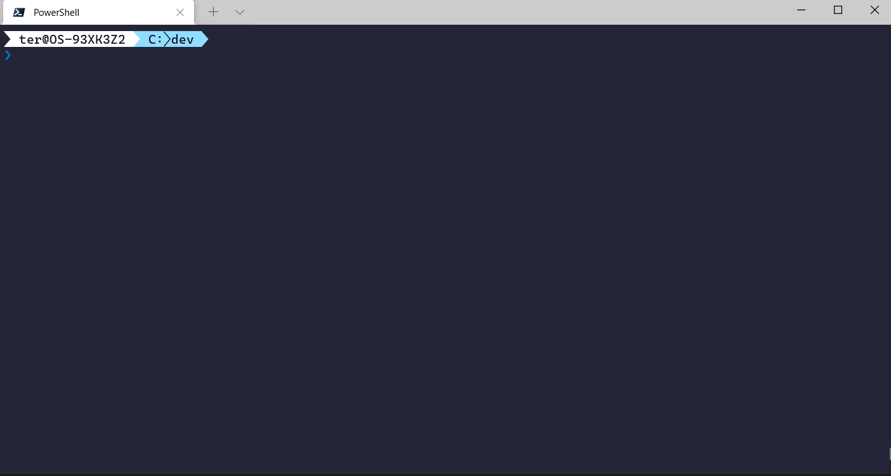

# Napal

A faster Performance Analysis of Logs

This is a tool that analyses .csv files and generates plots. The current use is for analyzing performance counter reports from Windows, but it's generic enough for other tasks.

## Examples:

`.\napal.exe testfile.csv`

- This uses the default metrics, plot settings and plot colors, located in the config/ directory.

`.\napal.exe -v -wm specific-metrics.txt testfile.csv`

 - This will print debug information, use the metrics located in the specific-metrics.txt file and use the plot settings and plot colors located in the config/ directory

`.\napal.exe testfile1.csv testfile2.csv`

This will use the default settings and create plots with two lines. This allows the comparison of different executions of the same thing.
  

## Parameters:

**[] are optional arguments
() Represents options
<> are obligatory**

**\<csv files>**
- The list of files that will be parsed and used to create plots.
- This is mandatory to be the last argument.

**[-t or -targetDir]**
- The directory where the results will be saved
- Default is `results/{year}-{month}-{day}_{hour}-{minute}-{second}`
	- Example: results/2021-05-18_10-10-10
	- Do note that the results/dir will be placed in the working directory.

**[-wm or -wantedMetrics]**
- The path for the file that contains which metrics are desired to be analyzed.
- Default is `config/DefaultMetrics.txt`. [(link)](<config/DefaultMetrics.txt>)

**[-ps or -plotSettings]**
- The path for the file that contains the settings to be used when plotting
- Default is `config/DefaultPlotSettings.txt`. [(link)](<config/DefaultPlotSettings.txt>)

**[-c or -colorsFile]**
- The path for the file that contains a list of the colors to be used in the graphs (by order)
- Default is `config/DefaultPlotLineColors.txt`. [(link)](<config/DefaultPlotLineColors.txt>)

**[-w or -widthPerPoint]**
- The width of the generated image per given point in each graph (x axis).
- Default is 1.

**[-s or -skipParse]**
- Whether the .csv files should be parsed or not. It is required for them to be parsed at least once, so that they generate the .altered.csv file.
- Default is false.

**[-tf or -timeFormat]**
- The format for the date column. How to write the format: https://docs.rs/chrono/0.4.7/chrono/format/strftime/index.html
- Default is `%m/%d/%Y %H:%M:%S.%f`
	- Example date: `05/02/2020 15:30:10.012`.
	- For more details on this default, look here [in the code](<src/parameters.rs>).

**[-xaxis (seconds|minutes)]**
- Whether the X axis of the plots should be in seconds or minutes.
- Default is `seconds`.
- Example: 
	- `.\napal.exe -xaxis seconds testfile1.csv`
	- `.\napal.exe -xaxis minutes testfile1.csv`

**[-v or -verbose]**
- Whether to display debug information.
- Default is to not display.

**[-h or -help]**
- Displays this information.

